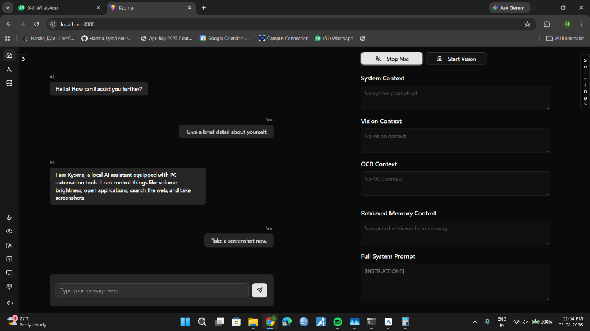
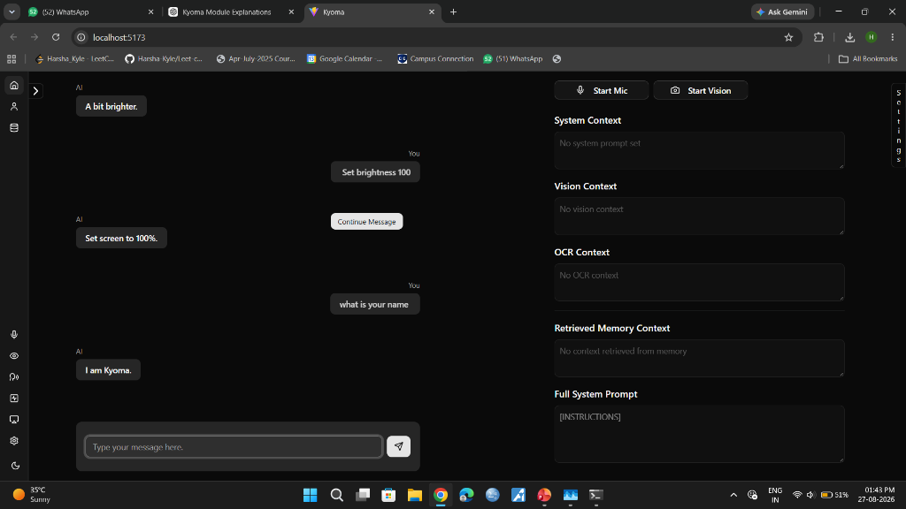
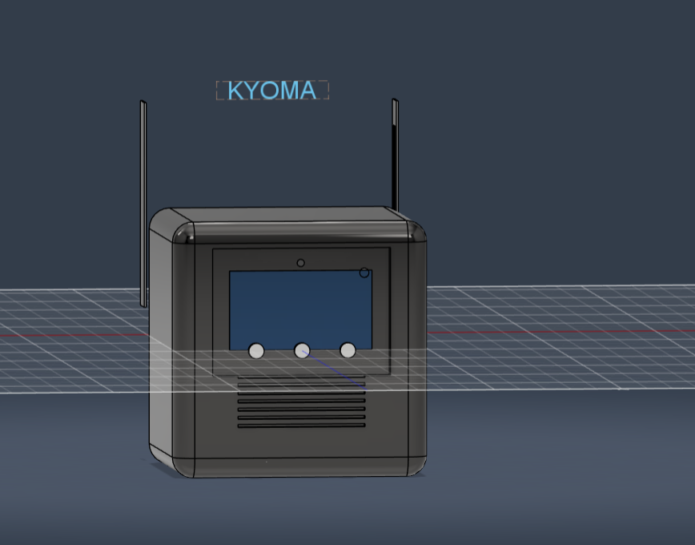
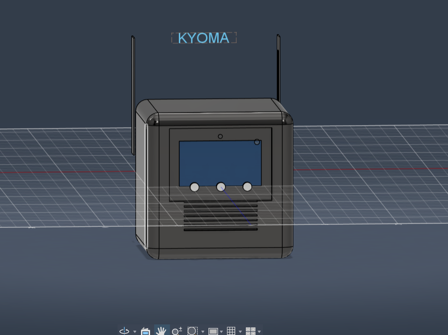
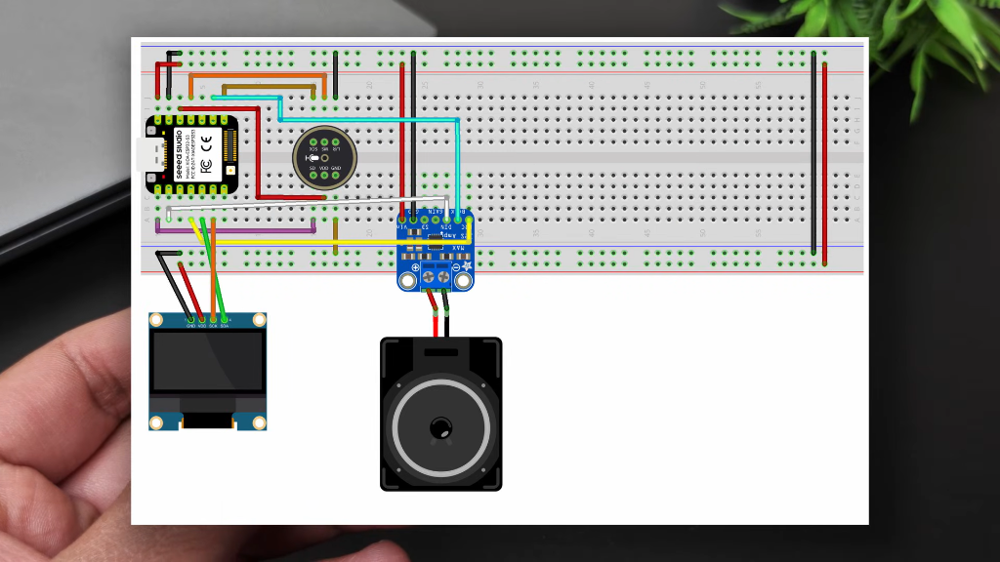
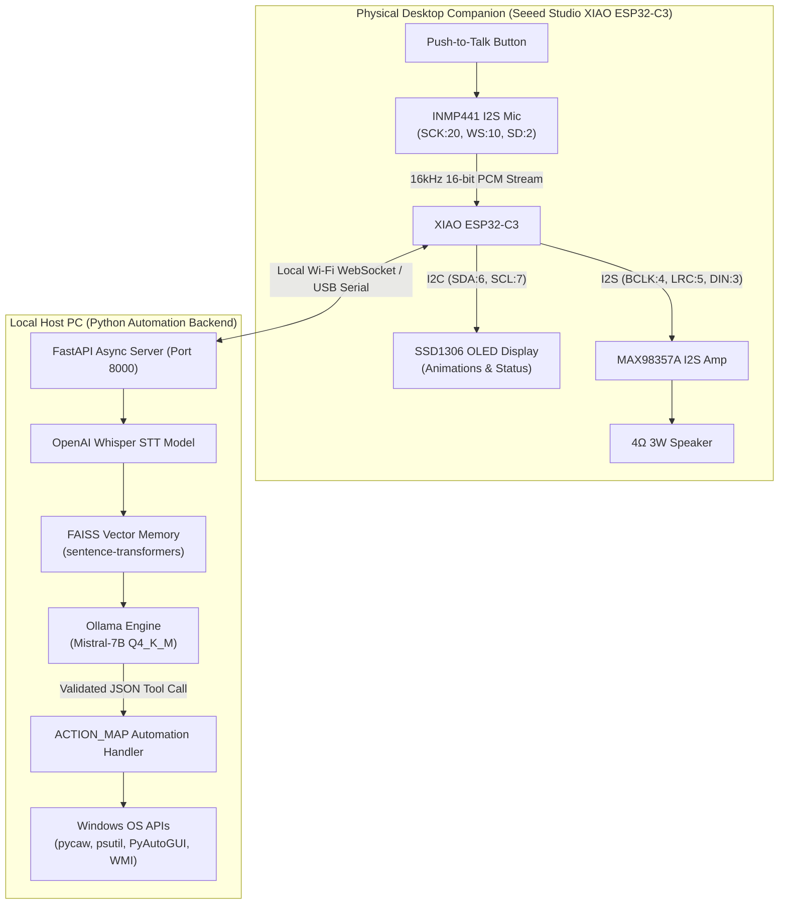

# 🤖 KYOMA: Offline AI-Enabled Desktop Companion & PC Automation System


**KYOMA** is an intelligent, privacy-first physical desktop companion and local voice-activated PC automation engine.

By combining dedicated edge hardware (**Seeed Studio XIAO ESP32-C3**, digital I2S audio, OLED expression display) with a powerful local AI stack (Whisper STT, Mistral-7B LLM, FAISS RAG vector memory, and FastAPI), KYOMA delivers sub-300ms voice automation—100% offline with zero cloud dependency.

---

## 📌 Table of Contents

- [🌟 Project Highlights](#-project-highlights)
- [📸 System Showcase](#-system-showcase)
- [🔌 Hardware Setup & Pin Mapping](#-hardware-setup--pin-mapping)
- [🏗️ System Architecture](#️-system-architecture)
- [🖥️ PC Automation Capabilities (`ACTION_MAP`)](#️-pc-automation-capabilities-action_map)
- [🧠 Local RAG Context Memory](#-local-rag-context-memory)
- [🚀 Quick Start & Installation Guide](#-quick-start--installation-guide)
- [👥 Team & Credits](#-team--credits)

---

## 🌟 Project Highlights

- 🤖 **Physical Hardware Companion**: Powered by a compact **Seeed Studio XIAO ESP32-C3** microcontroller running real-time I2S audio streaming, push-to-talk sampling, and animated OLED display states.
- 🔒 **100% Privacy & Data Sovereignty**: All Speech-to-Text (Whisper) and Natural Language Processing (Mistral-7B via Ollama) execute strictly on your local PC. No audio recordings or text queries ever cross the network.
- ⚡ **Sub-300ms Interaction Latency**: High-throughput WebSocket communication combined with GPU-accelerated local AI inference ensures instant, natural conversational responses.
- 💻 **Hands-Free Computer Automation**: Perform routine OS actions using simple voice commands—adjust volume & brightness, launch/close applications, open project folders, control media playback, search the web, take screenshots, and set reminders.
- 🧠 **Context-Aware Vector Memory**: Built-in FAISS vector database powered by `sentence-transformers` embeddings stores past user interaction history for personalized assistance.
- 👁️ **Visual & Screen Context**: Web dashboard equipped with real-time screen vision context, OCR text extraction, and live system status tracking.

---

## 📸 System Showcase

### 🖥️ Web Dashboard & Control Center

The interactive Web Dashboard displays KYOMA's active system prompts, screen vision context, OCR extractions, retrieved memory history, and natural language PC automation chat interface.

| System & Memory Context View | PC Automation & Screen Controls |
| :---: | :---: |
|  |  |

---

### 🎨 Hardware Enclosure & 3D CAD Modeling

KYOMA is physically embodied as a dedicated companion on your desk. The enclosure features custom 3D CAD modeling and integrated digital audio channels.

| 3D CAD Enclosure Model (Front View) | 3D CAD Enclosure Model (Side View) |
| :---: | :---: |
|  |  |

---

### ⚡ Breadboard Wiring Diagram



*Complete Hardware Circuit Wiring Diagram showing the Seeed Studio XIAO ESP32-C3, INMP441 I2S Digital Microphone, MAX98357A I2S Class D Amplifier, 4Ω 3W Speaker, and SSD1306 I2C OLED Display.*

---

## 🔌 Hardware Setup & Pin Mapping

KYOMA utilizes high-fidelity digital audio buses (**I2S**) and high-speed serial (**I2C**) to guarantee noise-free voice sampling and smooth display updates.

| Hardware Component | Hardware Part | Pin Connections | Purpose |
| :--- | :--- | :--- | :--- |
| **Microcontroller** | **Seeed Studio XIAO ESP32-C3** | Wi-Fi 2.4GHz + I2S + I2C | System Controller & Communication Gateway |
| **OLED Display** | **SSD1306 128x64 (I2C)** | `SDA = GPIO 6`, `SCL = GPIO 7` | Intro Animation, Expression & Status Display |
| **Microphone** | **INMP441 I2S Digital Mic** | `SCK = GPIO 20`, `WS = GPIO 10`, `SD = GPIO 2` | Push-to-talk Audio Input Capture |
| **Audio Amplifier / Speaker** | **MAX98357A I2S Class D Amp + 4Ω 3W Speaker** | `BCLK = GPIO 4`, `LRC = GPIO 5`, `DIN = GPIO 3` | Plays Audio Output / Vocal Feedback |

---

## 🏗️ System Architecture



---

## 🖥️ PC Automation Capabilities (`ACTION_MAP`)

KYOMA translates natural language voice requests into structured JSON tool calls that safely execute on your computer:

| Automation Category | Natural Voice Example | Tool Executed | Underlying OS API / Driver |
| :--- | :--- | :--- | :--- |
| **System Volume** | *"Set volume to 50%"* / *"Mute audio"* | `volume_set`, `volume_mute` | Windows `pycaw` COM Audio Interface |
| **Display Brightness** | *"Make the screen brighter"* | `brightness_up`, `brightness_set` | Windows WMI / `screen-brightness-control` |
| **App Management** | *"Open Google Chrome"* / *"Close Spotify"* | `open_application`, `close_application` | `subprocess.Popen` / `psutil` process tree |
| **Folder Access** | *"Open my project directory"* | `open_folder` | Windows File Explorer (`os.startfile`) |
| **Media Playback** | *"Pause music"* / *"Play next track"* | `media_play_pause`, `media_next` | `PyAutoGUI` hardware key simulation |
| **Web Research** | *"Search the web for Python tutorials"* | `web_search` | Default Browser Dispatch |
| **Screen Capture** | *"Take a screenshot now"* | `take_screenshot` | Full-screen PyAutoGUI image capture |
| **Timed Reminders** | *"Remind me in 15 minutes to join the call"* | `set_reminder` | Asynchronous `win10toast` thread |

---

## 🧠 Local RAG Context Memory

KYOMA includes a local **Retrieval-Augmented Generation (RAG)** pipeline:
1. **Embedding**: User interaction pairs (transcription → tool call → outcome) are encoded into 384-dimensional dense vectors using `sentence-transformers` (`all-MiniLM-L6-v2`).
2. **Indexing**: Vectors are stored in a local **FAISS** (`IndexFlatL2`) vector index alongside JSON metadata.
3. **Retrieval**: On every new query, the top semantically relevant past interactions are retrieved in ~12ms and injected into the system prompt, enabling KYOMA to learn your preferences.

---

## 🚀 Quick Start & Installation Guide

### Prerequisites
- **Operating System**: Windows 10 / 11
- **Python**: Version 3.10+ installed
- **GPU**: NVIDIA GPU (6GB+ VRAM recommended) with CUDA 12.4
- **Ollama**: Installed locally with the `mistral` model (`ollama pull mistral`)

### 1. Clone & Set Up Backend

```bash
# Clone the repository
git clone https://github.com/HarshaKyle/KYOMA-AI-Automation.git
cd KYOMA-AI-Automation/backend

# Create virtual environment
python -m venv venv
.\venv\Scripts\activate

# Install PyTorch with CUDA 12.4 acceleration
pip install torch torchvision torchaudio --index-url https://download.pytorch.org/whl/cu124

# Install Backend & Automation dependencies
pip install fastapi uvicorn whisper pycaw screen-brightness-control pyautogui psutil faiss-cpu sentence-transformers requests numpy
```

### 2. Launch the KYOMA Engine

```bash
# Activate environment and start server
.\venv\Scripts\activate
python server.py
```

*Or simply double-click **`start.bat`** in the root directory.*

Access the interactive dashboard by opening `http://localhost:8000` (or `http://localhost:5173`) in your web browser.

---


Built with ❤️ using Seeed Studio XIAO ESP32-C3, FastAPI, OpenAI Whisper, Ollama & FAISS.
